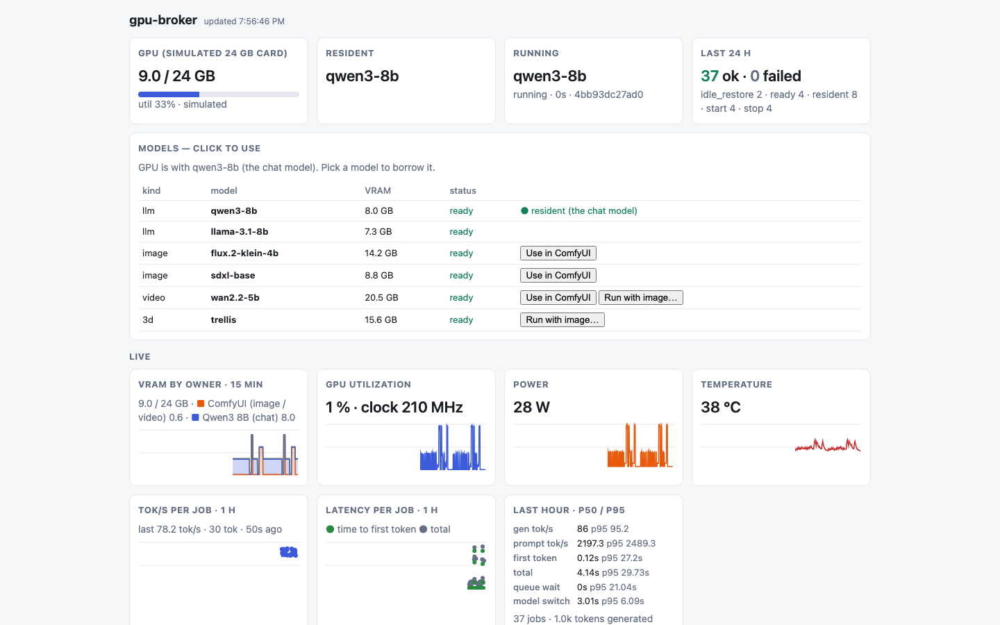
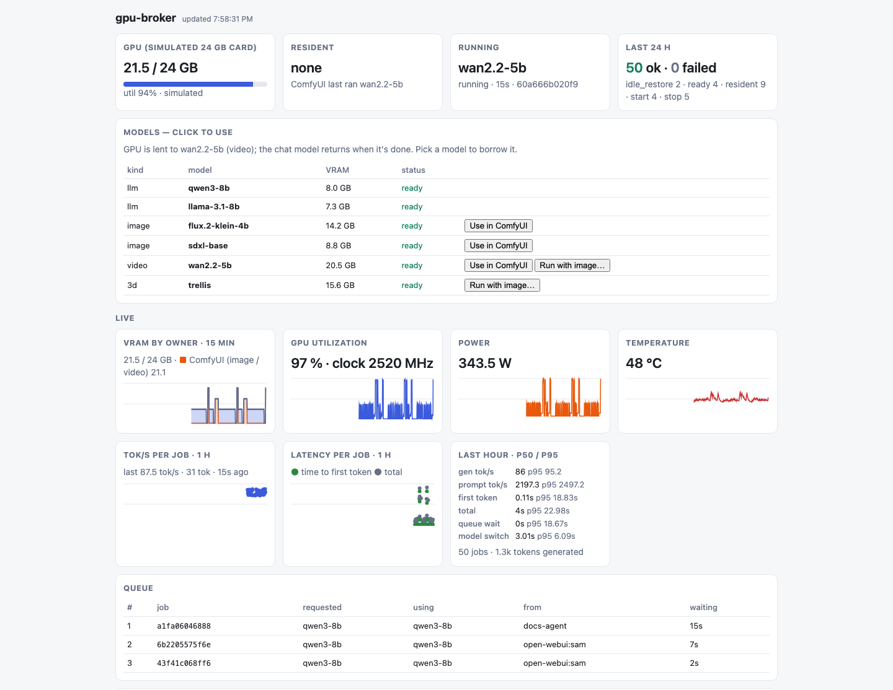
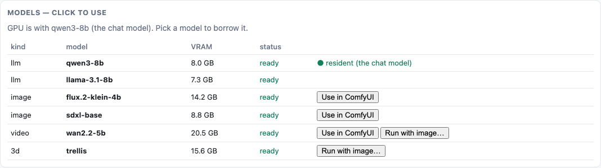
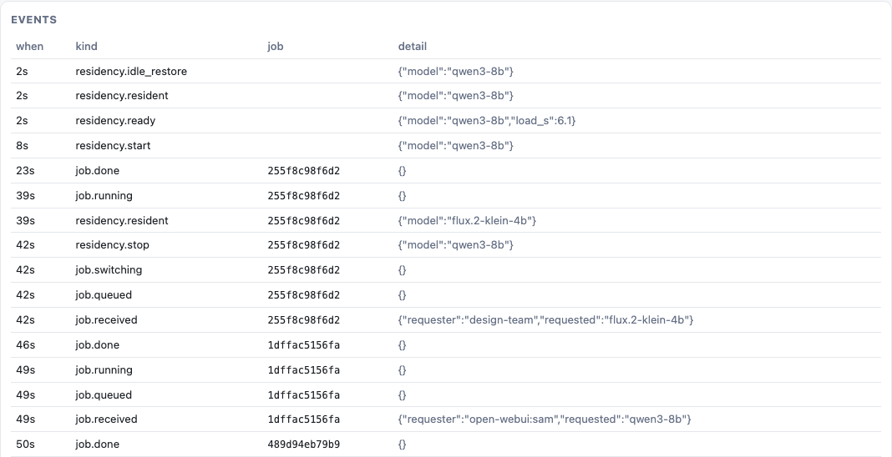

# gpu-broker

## TLDR: just install it

```bash
pip install gpu-broker      # or: uvx gpu-broker setup
gpu-broker setup
```

It finds your GPU and model servers, writes the config, starts the service and opens the dashboard.

---

gpu-broker lets a chat model, an image generator and a video generator take turns on one
graphics card, switching between them for you as requests arrive.

[](https://pypi.org/project/gpu-broker/)
[](https://github.com/emergenthq-net/gpu-broker/actions/workflows/ci.yml)
[](LICENSE)


## Who it's for

**You, with one GPU and more work than fits on it.** Your background agents keep a local LLM
busy all day. You chat with it too. Now and then you want an image or a short video. The chat
model and the image model don't fit in the card's memory together.

Without gpu-broker you stop the LLM, start ComfyUI, make the image, and restart the LLM by
hand; your agents stall until you do. With it, you just send the request.

It also fits:

- **A small team sharing one workstation.** Everyone gets one address; nobody switches models by hand.
- **Scripts and agents** that need several kinds of model (chat, image, video, 3D) from one machine.
- **A home lab** with one good GPU.

## What it does

- **One address for everything.** Chat, image and video requests all go to gpu-broker.
- **Takes turns on the card.** For an image or video job it:
  - lets the chats in progress finish,
  - stops the chat model,
  - runs the job,
  - queues whatever arrives meanwhile.
- **Puts the chat model back by itself** once the card has been quiet for a couple of minutes.
- **Keeps people ahead of batch work.** Your own chats skip the queue and stream token by token.
- **Shows what is happening.** A web dashboard shows what is loaded, what runs, what waits, and every switch.
- **Speaks the OpenAI and Anthropic APIs,** so Open WebUI and the official SDKs connect unchanged.

## See it


*The chat model is loaded and answering. The live charts show the card's memory, load, power
and temperature.*


*A video was requested. The chat model was stopped to make room; chats that arrive wait in the
queue until the video is done.*


*Every model it can run. You can borrow the whole GPU for hands-on work in ComfyUI; it goes
back to the chat model when you are done.*


*The event log, newest first: the chat model stopped for an image, then came back on its own.*

## Try it in 30 seconds

No GPU needed. The demo runs the real dashboard and API on a simulated card, with simulated
users. You need Python 3.12 or newer.

```bash
pip install gpu-broker
gpu-broker demo
```

Or without installing: `uvx gpu-broker demo`.

- The dashboard opens in your browser. Over SSH, or with `--no-browser`, open the printed link.
- Within two minutes, someone asks for a video and the chat model steps aside.
- `gpu-broker demo --quiet` leaves out the simulated users, so you can send your own requests.
  It prints a `curl` line to start from.
- Nothing real runs: no model is downloaded, and the "images" are placeholders.

## Quickstart

```bash
pip install gpu-broker               # add [download] to fetch models: pip install 'gpu-broker[download]'
gpu-broker setup                     # or first see what it would do: gpu-broker setup --dry-run
```

`setup` asks no questions. It:

- **finds the GPU** (NVIDIA or AMD) and its memory;
- **finds your model servers**: llama.cpp, vLLM, Ollama and ComfyUI on their usual ports, and the
  systemd units or Docker containers that run them;
- **writes** `config.yaml` and `catalog.yaml` for what it found (the starter files if it found
  nothing), and a new API token in `broker.env` (mode 600);
- **installs and starts the `gpu-broker` service**: a user service if your model servers are
  `systemctl --user` units, else a system service when it has root or passwordless sudo. The
  broker never runs as root. Otherwise it prints the exact `serve` command, and runs it for you
  when you're at a terminal;
- **runs `check`**, waits until the broker answers, and **opens the dashboard** (not over SSH).

Running it again is safe: it keeps every file it finds, and the token. Details, flags and what
each estimate means: [docs/setup.md](docs/setup.md).

## Manual setup

For full control, set it up by hand: pick how your model servers run.

| your model servers are | route |
|---|---|
| systemd units on this machine | [systemd](#systemd) |
| Docker containers | [Docker compose](#docker-compose) |
| systemd units in Proxmox LXCs | [Proxmox](#proxmox) |

### systemd

Create the model servers' units as you normally would. Then:

```bash
sudo gpu-broker init                 # writes /etc/gpu-broker/{config,catalog}.yaml, creates its folders
sudoedit /etc/gpu-broker/catalog.yaml   # your units, endpoints and model sizes
gpu-broker check                     # validates both files, prints the driver and the unit allowlist
sudo BROKER_TOKEN=$(openssl rand -hex 24) gpu-broker serve
```

- `init` never overwrites existing files (`--force` does). `--dir` writes elsewhere.
- It listens on `127.0.0.1:8095` (`server.host`, `server.port`).
- The broker runs `systemctl start/stop` on the catalog's units.
  - Run it as root, or set `driver.sudo: true` with a sudoers rule limited to those units.
- To run it as a service: [`examples/systemd/gpu-broker.service`](examples/systemd/gpu-broker.service).
  - Keep its `TimeoutStopSec` above `server.graceful_shutdown_s` (default 10 s).

### Docker compose

This route needs a clone, for the compose files in `examples/docker`. It also needs Docker and
the NVIDIA Container Toolkit.

```bash
git clone https://github.com/emergenthq-net/gpu-broker && cd gpu-broker/examples/docker
mkdir -p conf data models/llama-3.1-8b && cp config.yaml ../catalog.yaml conf/
sudo chown -R 10001:10001 conf data          # the broker runs as uid 10001 and rewrites catalog.yaml
echo "BROKER_TOKEN=$(openssl rand -hex 24)" > .env
echo "DOCKER_GID=$(getent group docker | cut -d: -f3)" >> .env
pip install huggingface_hub                  # provides the `hf` CLI, for the one-off model fetch
hf download bartowski/Meta-Llama-3.1-8B-Instruct-GGUF Meta-Llama-3.1-8B-Instruct-Q4_K_M.gguf \
  --local-dir models/llama-3.1-8b
docker compose up -d --build
```

- It runs the broker, llama.cpp's `llama-server` and ComfyUI.
- The broker starts and stops the other two through the Docker socket. It never creates or removes containers.
- The dashboard is at http://localhost:8095/dash. It asks once for the token from `.env`.
- Image and video models need their files in ComfyUI's model folders (the `comfy-models` volume).
  - The comments in [`examples/catalog.yaml`](examples/catalog.yaml) name the files each entry expects.

### Proxmox

The broker runs in its own LXC or VM. The model servers are systemd units in other containers.

1. Start from [`examples/config.proxmox.yaml`](examples/config.proxmox.yaml).
2. On the host, install [`host/gpu-broker-ctl`](host/gpu-broker-ctl) as the broker key's forced command
   (see [Security](#security)).
3. Install [`host/gpu-broker-gpu`](host/gpu-broker-gpu), its GPU reader, next to it.

## Use it

```bash
# after setup the token is in broker.env (/etc/gpu-broker, or ~/.config/gpu-broker without root)
export BROKER_TOKEN=$(sudo sed -n 's/^BROKER_TOKEN=//p' /etc/gpu-broker/broker.env)
T="Authorization: Bearer $BROKER_TOKEN"
curl -s localhost:8095/v1/chat/completions -H "$T" -H 'Content-Type: application/json' \
  -d '{"model":"llama","messages":[{"role":"user","content":"hi"}]}'
curl -s localhost:8095/v1/jobs -H "$T" -H 'Content-Type: application/json' \
  -d '{"model":"wan2.2-5b","prompt":"a fox in snow","wait":true}'
```

More examples and every route: [docs/api.md](docs/api.md).

## Connect your apps

- **Today:** gpu-broker answers both the OpenAI and the Anthropic API.
  - Apps and SDKs built for either work by changing only the base URL and key.
  - Details: [docs/drop-in.md](docs/drop-in.md).
- **Coming:** `gpu-broker connect` (or **Connect apps** on the dashboard).
  - It finds the tools on your machine (your shell, Continue, Cline, Aider, Codex, Open WebUI)
    and points them at your local model. No settings to edit.
  - `gpu-broker disconnect` puts everything back.

## Documentation

| page | covers |
|---|---|
| [docs/setup.md](docs/setup.md) | `gpu-broker setup`: what it detects, what it writes, flags |
| [docs/catalog.md](docs/catalog.md) | the catalog: models, substitution, input files, bundled ComfyUI templates |
| [docs/exec-recipes.md](docs/exec-recipes.md) | command-line models (`runner: exec`): recipes, timeouts, GPU holds |
| [docs/api.md](docs/api.md) | every route, request fields, headers |
| [docs/drop-in.md](docs/drop-in.md) | using it in place of the OpenAI and Anthropic APIs |
| [docs/hardware.md](docs/hardware.md) | host drivers, supported GPUs, choosing the card |
| [ARCHITECTURE.md](ARCHITECTURE.md) | module layout and invariants |
| [SECURITY.md](SECURITY.md), [docs/threat-model.md](docs/threat-model.md) | security model and threat model |

### Command-line models

- Some models are a program, not a ComfyUI graph: image-to-3D tools, for example.
- gpu-broker runs them from a **recipe** file the host's administrator writes.
- A request names the recipe but never carries a command.
- Details: [docs/exec-recipes.md](docs/exec-recipes.md). Example: [`examples/recipes/sharp.recipe`](examples/recipes/sharp.recipe).

## How it works


- **One GPU thread.** Models switch only between jobs, never mid-job.
- **Every LLM call holds a pool slot.** Before a switch, the pool closes and in-flight calls finish.
- **People first.** Background calls may fill `slots - reserved_interactive` slots; people may use them all.
- **Safe switches.** ComfyUI frees its weights before an LLM starts; the LLM stops before a ComfyUI job.
  - Health is re-checked, not assumed, since someone else may stop things.
- **Idle restore.** After `idle_restore_s` with an empty queue, `defaults.resident` comes back.
- **Log.** Every state change is a SQLite row and a JSONL line.

### Compared with llama-swap

[llama-swap](https://github.com/mostlygeek/llama-swap) is excellent if all you run is
OpenAI-compatible LLM servers. gpu-broker covers what it doesn't:

| | llama-swap | gpu-broker |
|---|---|---|
| Swap between LLM servers on request | yes | yes |
| LLMs and ComfyUI share one GPU | – | yes |
| Queue with positions, job states and an event log | – | yes (SQLite + JSONL) |
| Substitution, with the reason reported | – | yes |
| Downloads by Hugging Face repo or GitHub URL | – | yes |
| Interactive GPU sessions for ComfyUI | – | yes |
| Concurrent calls to the resident LLM | proxied | up to `slots`, some reserved for people |
| Where model servers live | processes it launches | systemd units, Docker containers, Proxmox LXCs |

- Only swapping LLMs: use llama-swap.
- One card serving chat *and* diffusion: use this.

## Security

Details: [SECURITY.md](SECURITY.md). Threat model: [docs/threat-model.md](docs/threat-model.md).

- **Token.** A bearer token, compared in constant time.
  - With none set, `serve` won't start.
  - Secrets come from the environment, never the config file.
- **Bind address.** `127.0.0.1` by default. Put TLS in front if you expose it.
- **Allowlist.** Drivers touch only units named in the catalog plus `comfy.unit`.
  - Names, references and paths are validated; files stay under fixed roots; nothing runs through a shell.
- **No SSRF by default.** The broker calls only URLs from its own config and catalog.
  - Fetching a caller's `<slot>_url` is opt-in (`inputs.allow_urls`).
- **Exec recipes are host configuration.** The command comes from the recipe file, never the request.
- **Proxmox: forced command, not a shell.** The host pins the broker's SSH key to one script:

  ```
  command="/usr/local/sbin/gpu-broker-ctl",restrict ssh-ed25519 AAAA... gpu-broker
  ```

  - It accepts only `unit`, `gpu`, `gpustream`, `download`, `comfy-link` and `exec-put` / `exec-info` / `exec-run` / `exec-clean`.
  - Only for the `<container>:<unit>` pairs in `ALLOW_UNITS` (`/etc/gpu-broker-ctl.conf`) and the recipes in `RECIPES`.
  - It re-validates every argument and logs each call. With no config file it allows nothing.
- **Dashboard.** The page carries no data and runs under a strict Content-Security-Policy.
  The token stays in your browser.

## FAQ

| question | answer |
|---|---|
| AMD / ROCm? | Yes. See [docs/hardware.md](docs/hardware.md). |
| Intel, Apple? | Not yet. Starting and stopping servers is vendor-neutral, but there is no GPU reader for them. |
| Multiple GPUs? | Not yet. One broker manages one GPU, the one `gpu.index` selects. |
| Does it run models itself? | No. It controls servers you already run (llama.cpp, vLLM, any OpenAI-compatible server with `/health`, plus ComfyUI). |
| Why not run everything at once? | VRAM. On 24 GB, an 8B LLM at Q4 takes 7–8 GB and a 5B video model at fp16 over 20 GB. Partial offloading makes both slow. |

## Limitations

- **One NVIDIA or AMD GPU.**
  - Per-process VRAM needs the host PID namespace; in a plain container you get totals only.
  - AMD support is tested against fixture files in the kernel's documented formats, not yet a live card.
- **LLM servers** must be OpenAI-compatible and answer `GET /health` with 200.
  - tok/s and time-to-first-token need llama.cpp's `timings` block.
- **Images and video run through ComfyUI only,** with a graph builder per model family in `gpu_broker/templates/`.
  - Some need custom node packs the broker does not install: see [Bundled templates](docs/catalog.md#bundled-templates).
- **One model at a time.** An LLM and a ComfyUI model are never loaded together, even when both would fit.
- **Downloads are not wired into ComfyUI.** Put the files in ComfyUI's model folders yourself.
  - A downloaded model with no template stays `needs_integration`.
- **Docker driver:** existing containers only; needs the root-equivalent Docker socket; no exec recipes.
- **Exec on Proxmox** copies each input file over its own SSH call, as base64.
  - Many `frames` mean many connections; send very large videos as `video_url`.
- **One shared token,** with no per-user accounts or rate limits.

## Roadmap

- A demand- and priority-aware scheduler, replacing strict FIFO for queued work.
- GPU readings for more vendors, and more than one GPU per host.
- Wiring downloaded files into ComfyUI from the API.
- `gpu-broker connect`.

## Contributing

Tests never touch a real GPU, host or network:

```bash
git clone https://github.com/emergenthq-net/gpu-broker && cd gpu-broker
python3 -m venv .venv && .venv/bin/pip install -e '.[dev]'
.venv/bin/pytest && .venv/bin/ruff check . && .venv/bin/mypy
```

House rules (layers, no magic values, new graphs and drivers): [CONTRIBUTING.md](CONTRIBUTING.md).

## Changelog

- **0.3.2** (2026-10-03): the source distribution is self-testing; unpack it, install it with `[dev]`, run `pytest`.
- **0.3.1** (2026-10-03): shipped tests use neutral ids and paths; CI scans every release for private names.
- **Unreleased:** `gpu-broker init` writes a starter config and catalog.

Every release: [CHANGELOG.md](CHANGELOG.md) and [GitHub Releases](https://github.com/emergenthq-net/gpu-broker/releases).

## License

Apache-2.0. See [LICENSE](LICENSE).
