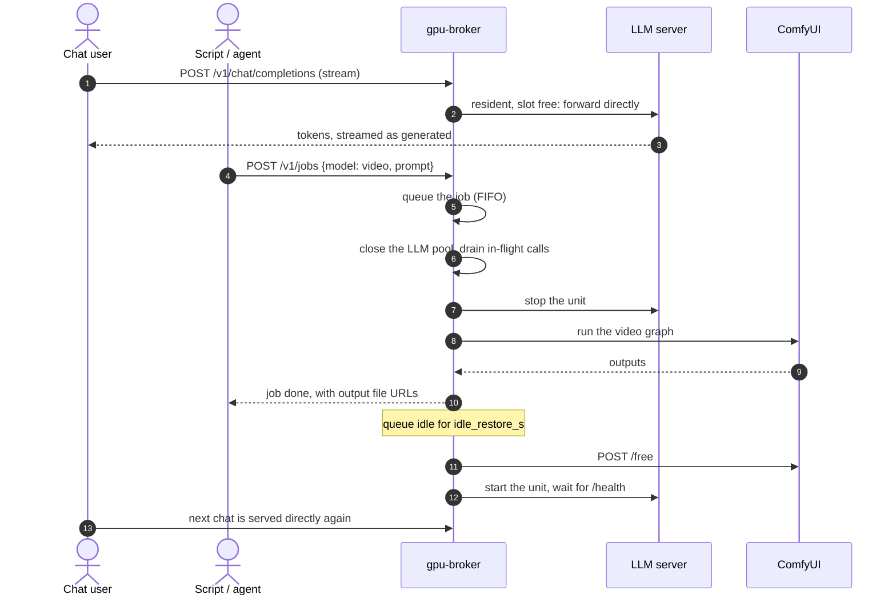

# gpu-broker

**One GPU, many models: LLMs, image and video share a single card.**

[](https://github.com/emergenthq-net/gpu-broker/actions/workflows/ci.yml)
[](LICENSE)


You have one consumer GPU. Most of the time it should hold a chat LLM that answers
instantly. Every so often someone wants an image or a video, and a diffusion model needs
the whole card. Running both at once doesn't fit in VRAM, and stopping and starting servers
by hand doesn't scale past one person. gpu-broker sits in front of your model servers,
queues every request, swaps the card between them safely, and puts your chat model back
when the GPU goes idle.



## Features

- **Capability routing:** request a model by name, or ask for `kind` + `caps` and let `model: auto` choose the best runnable implementation.
- **Residency-aware scheduling:** `balanced` priority + aging + locality avoids needless switches without starving old work; strict `fifo` remains available.
- **Fast lane for people:** interactive chat on the resident model skips the queue and streams token by token.
- **OpenAI-style API surface:** chat, completions, Responses, embeddings, rerank and score share the same routing and residency machinery.
- **Runtime contracts:** managed servers may declare their health path and supported API paths instead of being hard-coded to one server implementation.
- **Substitution with reasons:** unknown, unavailable, incompatible or too-large models resolve to the best installed capability match and report why.
- **Explain before executing:** `POST /v1/resolve` performs the same routing decision with no job, GPU switch or download side effect.
- **LLMs and ComfyUI on one card:** image/video jobs safely drain and release LLM residency; idle restore brings the default model back.
- **Durable operations:** SQLite job states, queue positions, downloads, events and JSONL audit log survive outside the UI.
- **Interactive ComfyUI sessions:** borrow the GPU from the control plane and return it automatically on idle.
- **Three host drivers:** systemd units, Docker containers, or systemd units inside Proxmox LXCs.
- **Operator control plane:** responsive dashboard for residency, scheduler state, capabilities, models, live GPU telemetry, queue, jobs and admin quiesce/resume.

### Compared with llama-swap

[llama-swap](https://github.com/mostlygeek/llama-swap) is a focused, mature proxy for
swapping model servers. Its scope now includes multiple kinds of local inference servers,
including ComfyUI integrations. gpu-broker overlaps with that lifecycle problem, but its
center of gravity is different: **requests become inspectable jobs in a capability-aware
control plane**.

| capability | llama-swap | gpu-broker |
|---|---|---|
| Swap managed model servers | yes | yes |
| OpenAI-compatible proxying | yes | yes |
| Durable job queue, states and event log | proxy-oriented | yes (SQLite + JSONL) |
| Capability-first `auto` routing | – | yes |
| Substitution with an explicit reason | – | yes |
| Priority + starvation aging + residency locality | – | yes |
| Side-effect-free routing explanation | – | `POST /v1/resolve` |
| ComfyUI graph execution as queued jobs | integration-dependent | bundled graph builders |
| Interactive whole-GPU sessions | – | yes |
| Model downloads tracked as operations | – | yes |
| Host lifecycle drivers | process/server oriented | systemd, Docker, Proxmox |
| Unified GPU/job/operator telemetry | – | built-in control plane |

If you need a lightweight model-server swap proxy, llama-swap is an excellent fit. If you
need the GPU treated as a schedulable resource with durable jobs, capability resolution and
operator state, gpu-broker is aimed at that layer.

## Quickstart

gpu-broker is not on PyPI yet. Every route below starts from a clone:

```bash
git clone https://github.com/emergenthq-net/gpu-broker && cd gpu-broker
```

### Docker compose

Needs Docker and the NVIDIA Container Toolkit. The compose file runs the broker, llama.cpp's
`llama-server` and ComfyUI. The broker starts and stops the other two through the Docker
socket; it never creates or removes containers.

```bash
cd examples/docker
mkdir -p conf data models/llama-3.1-8b && cp config.yaml ../catalog.yaml conf/
sudo chown -R 10001:10001 conf data          # the broker runs as uid 10001 and rewrites catalog.yaml
echo "BROKER_TOKEN=$(openssl rand -hex 24)" > .env
echo "DOCKER_GID=$(getent group docker | cut -d: -f3)" >> .env
pip install huggingface_hub                  # provides the `hf` CLI, for the one-off model fetch
hf download bartowski/Meta-Llama-3.1-8B-Instruct-GGUF Meta-Llama-3.1-8B-Instruct-Q4_K_M.gguf \
  --local-dir models/llama-3.1-8b
docker compose up -d --build
```

The dashboard is at http://localhost:8095/dash. It asks for the token from `.env` once.
Image and video models also need their files in ComfyUI's model folders (the
`comfy-models` volume). The comments in [`examples/catalog.yaml`](examples/catalog.yaml)
name the files each entry expects.

### systemd

The model servers are systemd units on the same machine; create them as you normally would.

```bash
python3 -m venv .venv && .venv/bin/pip install '.[download]'
sudo mkdir -p /etc/gpu-broker /var/lib/gpu-broker /var/log/gpu-broker
sudo cp examples/config.yaml examples/catalog.yaml /etc/gpu-broker/
.venv/bin/gpu-broker check        # loads config + catalog, prints the driver and the unit allowlist
sudo BROKER_TOKEN=$(openssl rand -hex 24) .venv/bin/gpu-broker serve
```

To run it as a service, use [`examples/systemd/gpu-broker.service`](examples/systemd/gpu-broker.service).
Its `TimeoutStopSec` sits just above `server.graceful_shutdown_s` (default 10 s), the longest a
stop waits for open connections such as a streaming chat; raise both together.

The broker needs to `systemctl start/stop` the units named in the catalog. Either run it as
root, or set `driver.sudo: true` with a sudoers rule limited to exactly those units. It
listens on `server.host:server.port`, which defaults to `127.0.0.1:8095`.

### Proxmox

The broker runs in its own LXC or VM; the model servers are systemd units inside other
containers. Start from [`examples/config.proxmox.yaml`](examples/config.proxmox.yaml) and
install [`host/gpu-broker-ctl`](host/gpu-broker-ctl) on the host as the broker key's forced
command, as described under [Security model](#security-model).

### Use it

```bash
T="Authorization: Bearer $BROKER_TOKEN"
# Chat. Served directly by the resident model when it is up; `"stream": true` streams tokens.
curl -s localhost:8095/v1/chat/completions -H "$T" -H 'Content-Type: application/json' \
  -d '{"model":"llama","messages":[{"role":"user","content":"hi"}]}'
# Any model as a job: the LLM stops, ComfyUI renders, and the LLM returns once the queue is idle.
curl -s localhost:8095/v1/jobs -H "$T" -H 'Content-Type: application/json' \
  -d '{"model":"wan2.2-5b","prompt":"a fox in snow","wait":true}'
curl -s localhost:8095/v1/status -H "$T"       # residency, queue, downloads, recent jobs
```

## Your first catalog

The catalog lists what may be requested and how each model runs. Here is a minimal one,
with one LLM and one ComfyUI model:

```yaml
defaults:
  resident: my-llm              # held on the card whenever nothing else needs it
  idle_restore_s: 120           # empty queue for this long → make `resident` resident again
  session_idle_s: 900           # interactive ComfyUI sessions (dashboard)
  session_yield_s: 120
  session_max_s: 14400
  vram_total_mib: 24564         # your card
  vram_reserve_mib: 600         # headroom; models above total - reserve are never loaded
  background_requesters: [batch-agent]   # x-requester values that never skip the queue

models:
  my-llm:
    kind: llm
    runner: llm_unit            # an OpenAI-compatible server the driver starts and stops
    unit: llama-server          # systemd unit or container name
    endpoint: http://127.0.0.1:8080
    served_name: llama-3.1-8b-instruct
    vram_mib: 7500
    slots: 4                    # matches llama-server -np 4
    reserved_interactive: 1     # background callers get 3 slots; one stays free for people
    variants: {my-llm-precise: {temperature: 0.1}}   # extra model id with request overrides
    caps: [chat, code]
    quality: 60
    status: ready
    aliases: [llama]

  sdxl:
    kind: image
    runner: comfy               # runs a graph on the shared ComfyUI
    template: sdxl              # a builder in gpu_broker/templates/
    params: {ckpt: sd_xl_base_1.0.safetensors}
    vram_mib: 9000
    caps: [t2i]
    quality: 60
    status: ready
```

**Capability routing.** A request can name an exact model, or use `model: auto` with `kind` and optional `caps`.
`auto` selects the highest-`quality` runnable model of that kind whose capabilities cover the request. For native
`/v1/jobs`, omitting `model` while supplying `kind` or `caps` is equivalent to `auto`.

**Substitution.** If a named model is unknown, unavailable, incompatible with the requested kind/capabilities,
or too large for the VRAM budget, the best ready compatible model runs instead when one exists. The response always
gives the substitute and the reason. `POST /v1/resolve` returns the same decision without creating a job, switching
residency, or starting a download.

**Runtime contracts.** LLM entries may set `health_path` (default `/health`), optional `metrics_path`, and `api_paths`
to declare the fixed broker routes that the upstream actually supports. This keeps heterogeneous OpenAI-compatible
servers declarative without allowing arbitrary proxy paths.
**Bundled templates.** A catalog `template` names one of these graph builders. Some use
nodes that stock ComfyUI does not ship; install those node packs on your ComfyUI first.
"Stock" means the nodes ship with a current ComfyUI release.

| template | model family | needs |
|---|---|---|
| `sdxl` | single-checkpoint SD / SDXL | stock ComfyUI |
| `qwen_image` | Qwen-Image 2.1 | [ComfyUI-GGUF](https://github.com/city96/ComfyUI-GGUF) when `unet` is a `.gguf` file |
| `chroma` | Chroma1-HD | stock ComfyUI |
| `flux2_klein` | FLUX.2 Klein (optional LoRA) | [ComfyUI-GGUF](https://github.com/city96/ComfyUI-GGUF) (`UnetLoaderGGUF`) |
| `wan14b`, `wan5b` | Wan 2.2 14B / 5B video | stock ComfyUI |
| `hunyuan` | HunyuanVideo 1.5 | stock ComfyUI |
| `minimax` | MiniMax H3 image-to-video with audio | stock ComfyUI |
| `ltx25` | LTX 2.5 text-to-video with audio | [ComfyUI-GGUF-Loader](https://github.com/ChrisColeTech/ComfyUI-GGUF-Loader) (`LTXV25ModelsLoader`, `LTXV25AVDecode`; verified at commit `142c614`) |

`ltx25` takes four files in `params`: `unet`, `clip`, `video_vae` and `audio_vae`. Its
defaults (97 frames at 768x512, 24 fps, 8 steps) took about 5 minutes on an RTX 4090.

The full annotated example is [`examples/catalog.yaml`](examples/catalog.yaml) and the config
is [`examples/config.yaml`](examples/config.yaml). Every config key and its default is in
[`gpu_broker/settings.py`](gpu_broker/settings.py); `gpu-broker check` validates both files.

## API

Every route except `/health` and the dashboard page needs `Authorization: Bearer $BROKER_TOKEN`.

| endpoint | purpose |
|---|---|
| `POST /v1/chat/completions` | OpenAI-compatible chat. Interactive callers on the resident model are served directly; `stream: true` relays tokens as generated. |
| `POST /v1/completions`, `/v1/responses` | Non-streamed generation through the same model resolution and residency scheduler. |
| `POST /v1/embeddings`, `/v1/rerank`, `/v1/score` | Non-streamed compatibility routes for servers/models that implement them. |
| `POST /v1/resolve` | Explain which model would run and why, with no execution or download side effects. |
| `POST /v1/jobs` | Native durable job API. Accepts exact `model` or capability-first `kind` + `caps` / `model:auto`. |
| `GET /v1/jobs/{id}` | Job state, queue position, model used and outputs. |
| `GET /v1/models` | Ready LLMs and their variants in OpenAI format. |
| `GET /v1/catalog`, `/v1/status`, `/v1/system` | Catalog, operational state, and control-plane inventory/policy. |
| `GET /v1/events?since=N` | Ordered event log. |
| `GET /v1/gpu`, `/v1/metrics`, `/v1/stats`, `/v1/ui` | GPU samples, latency/throughput metrics, aggregates and UI labels. |
| `POST /v1/sessions`, `/v1/sessions/end` | Borrow the GPU for interactive ComfyUI and return it. |
| `POST /v1/admin/quiesce`, `/v1/admin/resume` | Stop admitting work, drain/hold the direct path, and resume. |
| `GET /health`, `GET /dash` | Unauthenticated liveness and static control-plane shell. |

Two optional headers on inference requests:
- `x-requester` labels the caller.
- `x-priority: interactive|normal|background` declares queue priority. Background callers cannot consume slots reserved for people.
## How it works

- **One GPU thread, FIFO.** Residency changes only between jobs, never mid-job.
- **Every LLM call holds a pool slot.** Before a switch, the GPU thread closes the pool and
  waits for in-flight calls to finish. Afterwards it reopens the pool on the new resident
  model. A direct chat can only ever reach the model the pool names.
- **Priority.** Background calls may fill `slots - reserved_interactive` slots, and people may
  use them all, so a chat never waits behind batch work.
- **Residency.** Before an LLM starts, ComfyUI is told to `POST /free`. Before a ComfyUI job,
  the resident LLM is stopped. Health checks are re-run rather than trusted, because other
  operators may stop things.
- **Idle restore.** After `idle_restore_s` with an empty queue, `defaults.resident` comes back.
- **Log.** Every state change is a SQLite row and a JSONL line.

[ARCHITECTURE.md](ARCHITECTURE.md) covers the module layout and the invariants in detail.

## Host drivers

| `driver.kind` | model servers are | start/stop via | GPU readings |
|---|---|---|---|
| `systemd` (default) | units on this machine | `systemctl [--user]`, optionally `sudo -n` | local `nvidia-smi` |
| `docker` | existing containers | `docker start/stop` over the socket | `nvidia-smi` in the broker container |
| `proxmox` | systemd units inside LXCs | SSH to a forced-command script on the host | the host's `nvidia-smi` |

Catalog units are driver-neutral: `unit: llama-server`, or `unit: {name: llama-server, target: 101}`,
where `target` is the Proxmox container id.

## Security model

The full threat model is in [SECURITY.md](SECURITY.md). In short:

- **Token.** A bearer token is compared in constant time. With none set, every call is
  refused and `serve` won't start. Secrets come from the environment, never the config file.
- **Bind address.** `127.0.0.1` by default. Put TLS in front if you expose the broker.
- **Allowlist and validation.** Drivers only touch units named in the catalog plus
  `comfy.unit`. Unit names, repository references, slugs and paths are validated, files
  stay under fixed roots, and nothing runs through a shell.
- **No SSRF.** The broker only calls http(s) URLs from its own config and catalog.
- **Proxmox: forced command, not a shell.** The host pins the broker's SSH key to the script:

  ```
  command="/usr/local/sbin/gpu-broker-ctl",restrict ssh-ed25519 AAAA... gpu-broker
  ```

  The script accepts only `unit`, `gpu`, `gpustream`, `download` and `comfy-link`, for the
  `<container>:<unit>` pairs listed in `/etc/gpu-broker-ctl.conf` (`ALLOW_UNITS`). It
  re-validates every argument and logs each call. With no config file it allows no unit.
- **Dashboard.** The dashboard page carries no data and runs under a strict
  Content-Security-Policy. The token is kept only in the viewer's browser.

## FAQ

**AMD / ROCm, Intel, Apple?** Not yet. GPU readings come from `nvidia-smi`. Starting and
stopping servers is vendor-neutral, but the VRAM figures and dashboard charts are not.

**Multiple GPUs?** Not yet. One broker manages one GPU, and its readings come from the first
GPU `nvidia-smi` lists.

**Does it run models itself?** No. It controls servers you already run (llama.cpp, vLLM, or
any OpenAI-compatible server with a `/health` endpoint, plus ComfyUI) and decides which one
holds the card.

**Why not just run everything at once?** VRAM. On a 24 GB card, an 8B LLM at Q4 with a long
context takes about 7–8 GB, and a 5B video model at fp16 wants over 20 GB. They don't fit
together, and partial offloading makes both slow.

## Limitations

- **One NVIDIA GPU.** GPU readings come from `nvidia-smi` (the first GPU it lists), and per-process VRAM by owner needs the
  host PID namespace; inside a plain container you get totals only.
- **LLM servers** must be OpenAI-compatible and answer `GET /health` with 200. The tok/s and
  time-to-first-token figures need llama.cpp's `timings` block; other servers still work but
  show no throughput.
- **Images and video run through ComfyUI only.** Each model family needs a graph builder in
  `gpu_broker/templates/` (Python, not a workflow JSON file).
- **Some templates need custom ComfyUI node packs,** which the broker does not install. `ltx25`
  needs [ComfyUI-GGUF-Loader](https://github.com/ChrisColeTech/ComfyUI-GGUF-Loader) (verified
  at commit `142c614`) for `LTXV25ModelsLoader` and `LTXV25AVDecode`; GGUF model files need
  [ComfyUI-GGUF](https://github.com/city96/ComfyUI-GGUF). Without them ComfyUI rejects the
  graph and the job fails. The full list is under [Bundled templates](#your-first-catalog).
- **One LLM at a time.** An LLM and a ComfyUI model are never co-resident, even when both
  would fit.
- **Downloads land in the models root but aren't wired into ComfyUI automatically.** Put the
  files in ComfyUI's model folders yourself. A downloaded model with no template stays
  `needs_integration`.
- **The Docker driver** only starts and stops containers that already exist, and needs the
  Docker socket, which is root-equivalent on the host.
- **One shared token,** with no per-user accounts or rate limits.

## Roadmap

- A demand- and priority-aware scheduler, replacing strict FIFO for queued work.
- GPU readings for non-NVIDIA cards, and more than one GPU per host.
- Wiring downloaded files into ComfyUI from the API.

## Contributing

Tests never touch a real GPU, host or network:

```bash
python3 -m venv .venv && .venv/bin/pip install -e '.[dev]'
.venv/bin/pytest && .venv/bin/ruff check . && .venv/bin/mypy
```

See [CONTRIBUTING.md](CONTRIBUTING.md) for the house rules (layers, no magic values, new
graphs and drivers).

## License

Apache-2.0. See [LICENSE](LICENSE).
