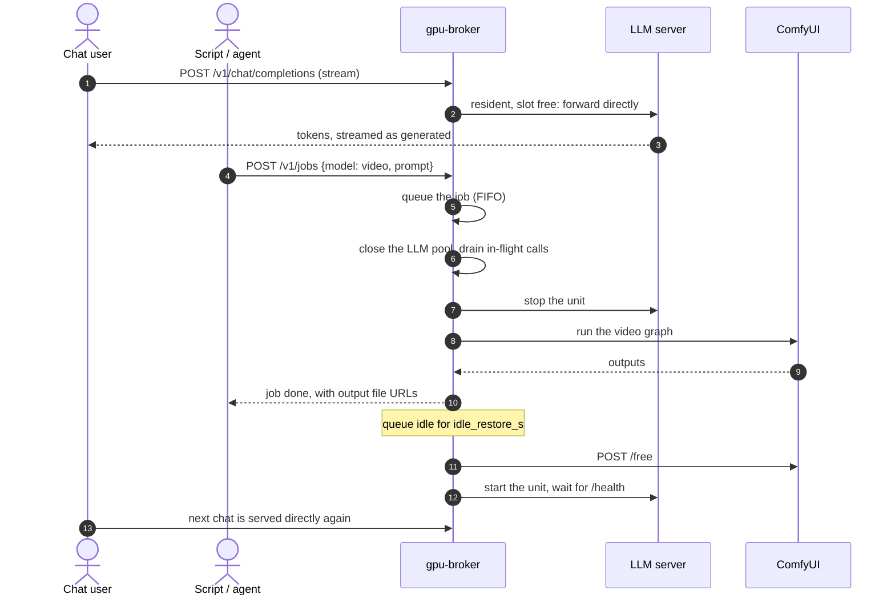

# gpu-broker

gpu-broker lets a chat assistant, an image generator and a video generator take turns on one
graphics card, so a team can share a single GPU without anyone switching models by hand.

[](https://github.com/emergenthq-net/gpu-broker/actions/workflows/ci.yml)
[](LICENSE)


## What it's for

You have one GPU. Your team chats with a local LLM all day; sometimes someone wants an image
or a short video. The chat model and the image model don't both fit in the card's memory.
Without gpu-broker, someone has to SSH in, stop the chat model, start ComfyUI, make the image,
then remember to put the chat model back. Until they do, nobody can chat.

gpu-broker does that juggling for you:

- **One address for everything.** Chat, image and video requests all go to gpu-broker, which
  knows what is loaded and what each request needs.
- **It takes turns on the card.** When an image or video request arrives, it lets the chats in
  progress finish, stops the chat model, runs the job, and lines up whatever arrives meanwhile.
- **It puts the chat model back by itself.** Once the card has been quiet for a couple of
  minutes, the chat model is loaded again, so the next chat answers straight away.
- **You can see what is happening.** A web dashboard shows what is loaded, what is running,
  who is waiting, and a log of every switch.
- **Use it instead of ChatGPT or Claude** *(coming)*. One command points the coding and chat
  tools you already use at your own model, and one command puts them back.

It is for a home lab with one good GPU, a small team sharing one workstation, and agents or
scripts that need several kinds of model (chat, image, video, 3D) from the same machine. It
speaks the same chat API as OpenAI, so chat apps such as Open WebUI connect to it unchanged.

## See it


*The team is chatting. The chat model is loaded, and a typical answer starts within a fraction
of a second; the live charts show the card's memory, load, power and temperature.*


*Someone asked for a video. gpu-broker stopped the chat model to make room; the video is
rendering, and the chats that arrived meanwhile wait in the queue until it is done.*


*Every model it can run. From here you can borrow the whole GPU for hands-on work in ComfyUI;
it is handed back to the chat model when you are done.*


*The event log, newest first: the chat model was stopped to make an image, then loaded again on
its own once nothing else needed the card.*

## Try it in 30 seconds

No GPU needed. The demo runs the real dashboard and API on a simulated graphics card, with a
few simulated people using it. You need Python 3.12 or newer.

```bash
pipx install git+https://github.com/emergenthq-net/gpu-broker
gpu-broker demo
```

Or, without installing anything: `uvx --from git+https://github.com/emergenthq-net/gpu-broker gpu-broker demo`.

The dashboard opens in your browser (over SSH, or with `--no-browser`, open the link it prints
instead). Within two minutes you will see someone ask for a video and the
chat model step aside. `gpu-broker demo --quiet` leaves out the simulated people, so you can
send your own requests (the demo prints a `curl` line to start from). Nothing real runs: no
model is downloaded, and the "images" it makes are placeholders that repeat the prompt.

## Use it instead of ChatGPT or Claude *(coming)*

Run `gpu-broker connect`, or click **Connect apps** on the dashboard, and the tools on your
machine (your shell, Continue, Cline, Aider, Codex, Open WebUI) use your local model instead of
a hosted one. You don't edit any settings: gpu-broker finds the tools and configures them.
`gpu-broker disconnect` puts everything back the way it was.

gpu-broker already answers both the OpenAI and the Claude (Anthropic) API, so apps built for
either work against it today; [docs/drop-in.md](docs/drop-in.md) has the details. The `connect`
command that sets them up for you is coming next.

## How a request flows



## Features

- **Queue and residency:** one GPU worker runs jobs in order and swaps models only between jobs.
- **LLMs and ComfyUI on one card:** an image or video job stops the LLM; idle restore brings it back.
- **Fast lane for people:** interactive chat on the resident model skips the queue and streams token by token.
- **OpenAI-compatible:** `/v1/chat/completions` and `/v1/models`, so existing chat UIs work unchanged.
- **Drop-in for ChatGPT and Claude:** OpenAI and Anthropic SDKs work by changing only the base URL and key ([docs/drop-in.md](docs/drop-in.md)).
- **Substitution:** an unknown, missing or too-large model runs on the best installed match, and the job says why.
- **Downloads:** ask for a Hugging Face repo or a GitHub URL and it is fetched in the background.
- **Interactive ComfyUI sessions:** borrow the whole GPU from the dashboard; it is returned when you go idle.
- **Three host drivers:** systemd units, Docker containers, or systemd units inside Proxmox LXCs.

### Compared with llama-swap

[llama-swap](https://github.com/mostlygeek/llama-swap) is excellent if all you run is
OpenAI-compatible LLM servers. gpu-broker is for the case llama-swap does not cover:

| | llama-swap | gpu-broker |
|---|---|---|
| Swap between LLM servers on request | yes | yes |
| LLMs and ComfyUI share one GPU | – | yes |
| Queue with positions, job states and an event log | – | yes (SQLite + JSONL) |
| Substitution, with the reason reported | – | yes |
| Downloads by Hugging Face repo or GitHub URL | – | yes |
| Interactive GPU sessions for ComfyUI | – | yes |
| Concurrent calls to the resident LLM | proxied | up to `slots`, some reserved for people |
| Where model servers live | processes it launches | systemd units, Docker containers, Proxmox LXCs |

If you only swap LLMs, use llama-swap. If one card has to serve chat *and* diffusion, use this.

## Quickstart

gpu-broker is not on PyPI yet. Every route below starts from a clone:

```bash
git clone https://github.com/emergenthq-net/gpu-broker && cd gpu-broker
```

### Docker compose

Needs Docker and the NVIDIA Container Toolkit. The compose file runs the broker, llama.cpp's
`llama-server` and ComfyUI. The broker starts and stops the other two through the Docker
socket; it never creates or removes containers.

```bash
cd examples/docker
mkdir -p conf data models/llama-3.1-8b && cp config.yaml ../catalog.yaml conf/
sudo chown -R 10001:10001 conf data          # the broker runs as uid 10001 and rewrites catalog.yaml
echo "BROKER_TOKEN=$(openssl rand -hex 24)" > .env
echo "DOCKER_GID=$(getent group docker | cut -d: -f3)" >> .env
pip install huggingface_hub                  # provides the `hf` CLI, for the one-off model fetch
hf download bartowski/Meta-Llama-3.1-8B-Instruct-GGUF Meta-Llama-3.1-8B-Instruct-Q4_K_M.gguf \
  --local-dir models/llama-3.1-8b
docker compose up -d --build
```

The dashboard is at http://localhost:8095/dash. It asks for the token from `.env` once.
Image and video models also need their files in ComfyUI's model folders (the
`comfy-models` volume). The comments in [`examples/catalog.yaml`](examples/catalog.yaml)
name the files each entry expects.

### systemd

The model servers are systemd units on the same machine; create them as you normally would.

```bash
python3 -m venv .venv && .venv/bin/pip install '.[download]'
sudo mkdir -p /etc/gpu-broker /var/lib/gpu-broker /var/log/gpu-broker
sudo cp examples/config.yaml examples/catalog.yaml /etc/gpu-broker/
.venv/bin/gpu-broker check        # loads config + catalog, prints the driver and the unit allowlist
sudo BROKER_TOKEN=$(openssl rand -hex 24) .venv/bin/gpu-broker serve
```

To run it as a service, use [`examples/systemd/gpu-broker.service`](examples/systemd/gpu-broker.service).
Its `TimeoutStopSec` sits just above `server.graceful_shutdown_s` (default 10 s), the longest a
stop waits for open connections such as a streaming chat; raise both together.

The broker needs to `systemctl start/stop` the units named in the catalog. Either run it as
root, or set `driver.sudo: true` with a sudoers rule limited to exactly those units. It
listens on `server.host:server.port`, which defaults to `127.0.0.1:8095`.

### Proxmox

The broker runs in its own LXC or VM; the model servers are systemd units inside other
containers. Start from [`examples/config.proxmox.yaml`](examples/config.proxmox.yaml) and
install [`host/gpu-broker-ctl`](host/gpu-broker-ctl) on the host as the broker key's forced
command, as described under [Security model](#security-model), with
[`host/gpu-broker-gpu`](host/gpu-broker-gpu) (its GPU reader) next to it.

### Use it

```bash
T="Authorization: Bearer $BROKER_TOKEN"
# Chat. Served directly by the resident model when it is up; `"stream": true` streams tokens.
curl -s localhost:8095/v1/chat/completions -H "$T" -H 'Content-Type: application/json' \
  -d '{"model":"llama","messages":[{"role":"user","content":"hi"}]}'
# Any model as a job: the LLM stops, ComfyUI renders, and the LLM returns once the queue is idle.
curl -s localhost:8095/v1/jobs -H "$T" -H 'Content-Type: application/json' \
  -d '{"model":"wan2.2-5b","prompt":"a fox in snow","wait":true}'
# Image-to-video or image edit: send the image as base64 (or a data: URL).
curl -s localhost:8095/v1/jobs -H "$T" -H 'Content-Type: application/json' \
  -d "{\"model\":\"wan2.2-5b\",\"prompt\":\"the fox runs\",\"image\":\"$(base64 < fox.png | tr -d '\n')\"}"
curl -s localhost:8095/v1/status -H "$T"       # residency, queue, downloads, recent jobs
```

## Your first catalog

The catalog lists what may be requested and how each model runs. Here is a minimal one,
with one LLM and one ComfyUI model:

```yaml
defaults:
  resident: my-llm              # held on the card whenever nothing else needs it
  idle_restore_s: 120           # empty queue for this long → make `resident` resident again
  session_idle_s: 900           # interactive ComfyUI sessions (dashboard)
  session_yield_s: 120
  session_max_s: 14400
  vram_total_mib: 24564         # your card
  vram_reserve_mib: 600         # headroom; models above total - reserve are never loaded
  background_requesters: [batch-agent]   # x-requester values that never skip the queue

models:
  my-llm:
    kind: llm
    runner: llm_unit            # an OpenAI-compatible server the driver starts and stops
    unit: llama-server          # systemd unit or container name
    endpoint: http://127.0.0.1:8080
    served_name: llama-3.1-8b-instruct
    vram_mib: 7500
    slots: 4                    # matches llama-server -np 4
    reserved_interactive: 1     # background callers get 3 slots; one stays free for people
    variants: {my-llm-precise: {temperature: 0.1}}   # extra model id with request overrides
    caps: [chat, code]
    quality: 60
    status: ready
    aliases: [llama]

  sdxl:
    kind: image
    runner: comfy               # runs a graph on the shared ComfyUI
    template: sdxl              # a builder in gpu_broker/templates/
    params: {ckpt: sd_xl_base_1.0.safetensors}
    vram_mib: 9000
    caps: [t2i]
    quality: 60
    status: ready
```

**Substitution.** If a request names an unknown model, one that isn't installed yet, or one
that won't fit, the highest-`quality` ready model of the same `kind` whose `caps` cover the
request runs instead. The response gives the substitute and the reason. If the model can be
downloaded, the download is queued as well.

**Input files.** An entry that takes files declares them in `inputs`:
- `{image: required}` for image-to-video or image editing
- `{image: optional}` for an optional start frame, plus `end_image: optional` where the model
  can pin the last frame too
- `{frames: one_of, video: one_of}` for a model that takes several views of a scene *or* one
  video of it (`one_of`: exactly one of those slots must be filled). `frames` can also say how
  many views the model uses: `frames: {need: one_of, min: 2, max: 32}` (other counts are a 400)

Only ComfyUI models with a `template` (single images) and `exec` models take inputs.
Capabilities a model has only with an input go in `image_caps` (e.g. `caps: [t2v]`,
`image_caps: [i2v]` for an optional start frame), so a text-only job never demands them of a
substitute.

A job sends `image`, `end_image` and `video` as base64 or a `data:` URL (or, if
`inputs.allow_urls` is on, as `<slot>_url`), and `frames` as a list of base64 images. The broker
checks everything at submit time (size caps, PNG/JPEG/WebP or MP4/MOV/WebM by magic bytes,
the frame count, model fit) and answers 400 rather than queueing a job that cannot run. For a
ComfyUI model it uploads the images as `broker-<job id>-<slot>.<ext>` just before the graph
runs; ComfyUI cannot delete inputs over its API, so prune them with the path unit in
[`examples/systemd/`](examples/systemd/comfyui-input-prune.path), which runs on each upload.
`<slot>_url` reaches only public addresses and output files of the broker's own ComfyUI, unless
`inputs.url_allow_networks` lists more. Substitutes for a job with
files are only models that take those files, and a model that requires one is never picked
for a job without it.

### Command-line models (`runner: exec`)

Some models are a program, not a ComfyUI graph: image → 3D Gaussian splat tools, for example.
The broker runs those as `exec` jobs: it evicts the resident LLM, frees ComfyUI's weights,
hands the job's input files to the program, and returns the files it wrote.

The command is never in the catalog or the request. It lives in a **recipe** file that the
host's administrator writes (`/etc/gpu-broker/recipes/<name>.recipe`). The catalog only names
it:

```yaml
  apple-sharp:
    kind: 3d
    runner: exec
    exec: {recipe: sharp, timeout_s: 660}   # >= recipe timeout_s + 10 s kill grace + 30 s
    inputs: {image: required}
    caps: [image_to_splat]
    vram_mib: 12000
    status: ready
```

```ini
# /etc/gpu-broker/recipes/sharp.recipe
argv=/opt/ml-sharp/.venv/bin/sharp predict -i {in_dir} -o {out_dir} -c {checkpoint} --no-render
checkpoint=/var/lib/gpu-broker/models/apple-sharp/sharp_2572gikvuh.pt
in_dir=/var/lib/gpu-broker/exec/in/{jid}
out_dir=/var/lib/gpu-broker/exec/out/{jid}
outputs=*.ply
timeout_s=600
```

`outputs` is one or more file name globs separated by spaces (`outputs=result.mp4 run.log`):
the job's outputs are each glob's files sorted by name, in the order the globs are listed,
each file once, so a recipe decides what `outputs[0]` is. Files whose names start with `.` are
never outputs.

The input files land in `in_dir` as `<slot>[-NN].<ext>` (`image.png`, `frames-00.png`, ...),
streamed from the staging directory. `out_dir` must end in `/{jid}`: only that folder is
created, in a parent you create once (on Proxmox it takes the parent's owner, so ComfyUI's user
can serve and prune it). The program runs with `GPU_BROKER_JOB=<job id>` in its environment,
gets SIGTERM at the recipe's `timeout_s` and SIGKILL 10 s later, and afterwards every process
still carrying that tag is killed (workers that left its process group included). The broker
refuses to start when a catalog `exec.timeout_s` is shorter than all that plus 30 s, or
`timeouts.exec_clean_s` shorter than the driver's clean plus 10 s (the driver reports its
timings; the Proxmox driver adds its SSH connect timeout, and the 10 s covers the rest of
reaching the host), checks it again before an exec job evicts anything, and before the job
runs it waits (up to `timeouts.exec_vram_s`) until the card shows the entry's
`vram_mib` free (by a GPU reading taken after the evictions returned). If a recipe may still
be running after its job ended, or the broker restarts while one runs, it holds the GPU: no
job runs until a clean it retries in the background every `intervals.held_retry_s` confirms
the job gone, or an operator calls `POST /v1/admin/gpu-held/clear` (effective at once).
The broker records each exec job's recipe (in the job store, not the request) at submit, and
marks every other job as not exec, so a restart still cleans an exec job after its model has
left the catalog. A direct chat never holds the GPU, and a model the catalog runs as exec
always does. A job with no record (written by an older broker) whose model is gone, and that
does not look like a chat, is held until an operator clears it.
Finding the job's processes needs a readable `/proc`: on the local driver, run the recipe as
the broker's own user (one that switches user is not tracked), and with `/proc` mounted
`hidepid` the scan can only say "unknown" while the program's own process is still visible. The hold is shown
in `/v1/status` and on the dashboard, and survives resume and restarts.
Request keys listed in `exec.params` arrive as `params.json`; `exec.choices` (`{param: [values]}`)
restricts a param to the listed values, so an unsupported one is a 400 at submit. The files matching `outputs`
become the job's result. When `out_dir` is under ComfyUI's output folder (`comfy.output_dir`),
each result also gets a ComfyUI `/view` URL. The format is documented in
[`gpu_broker/drivers/recipes.py`](gpu_broker/drivers/recipes.py), and
[`examples/recipes/sharp.recipe`](examples/recipes/sharp.recipe) is a working example.
The systemd driver runs recipes on the broker's machine and the Proxmox driver runs them
inside a container (`target=<ct>`); the Docker driver does not run them. Job folders are not
removed by the broker: install
[`examples/systemd/gpu-broker-exec-prune@.{path,service}`](examples/systemd/gpu-broker-exec-prune@.service)
where they are written, which deletes them two hours after the job (how long results stay
downloadable; raise its `-mmin` to keep them longer). Recipe files must use LF line ends.

**Bundled templates.** A catalog `template` names one of these graph builders. Some use
nodes that stock ComfyUI does not ship; install those node packs on your ComfyUI first.
"Stock" means the nodes ship with a current ComfyUI release.

| template | model family | needs |
|---|---|---|
| `sdxl` | single-checkpoint SD / SDXL | stock ComfyUI |
| `qwen_image` | Qwen-Image 2.1 | [ComfyUI-GGUF](https://github.com/city96/ComfyUI-GGUF) when `unet` is a `.gguf` file |
| `chroma` | Chroma1-HD | stock ComfyUI |
| `flux2_klein` | FLUX.2 Klein (optional LoRA) | [ComfyUI-GGUF](https://github.com/city96/ComfyUI-GGUF) (`UnetLoaderGGUF`) |
| `flux2_klein_edit` | FLUX.2 Klein 9B image edit (`image` required) | as `flux2_klein` |
| `qwen_edit` | Qwen-Image 2.1 image edit with prompt enhancer (`image` required) | stock ComfyUI (plus ComfyUI-GGUF for a `.gguf` `unet`) |
| `wan14b` | Wan 2.2 14B video; `params.mode: t2v` or `i2v` (`image` required) | stock ComfyUI |
| `wan5b` | Wan 2.2 5B video, optional start `image` | stock ComfyUI |
| `hunyuan` | HunyuanVideo 1.5 480p text-to-video | stock ComfyUI |
| `hunyuan_i2v` | HunyuanVideo 1.5 720p image-to-video (`image` required) | stock ComfyUI |
| `minimax` | MiniMax H3 video with audio; optional `image` / `end_image` frames | stock ComfyUI |
| `ltx25` | LTX 2.5 text-to-video with audio | [ComfyUI-GGUF-Loader](https://github.com/ChrisColeTech/ComfyUI-GGUF-Loader) (`LTXV25ModelsLoader`, `LTXV25AVDecode`; verified at commit `142c614`) |

`ltx25` takes four files in `params`: `unet`, `clip`, `video_vae` and `audio_vae`. Its
defaults (97 frames at 768x512, 24 fps, 8 steps) took about 5 minutes on an RTX 4090.

A catalog entry may retune a template's request-level defaults with `defaults:` (for example
`defaults: {steps: 20}` or `defaults: {enhance: false}` on a `qwen_edit` model). A request
still overrides them: request > entry `defaults` > template defaults. Only keys the template
reads as request options are accepted, so `params` remain the only way to choose files; any
other key fails at catalog load.

The full annotated example is [`examples/catalog.yaml`](examples/catalog.yaml) and the config
is [`examples/config.yaml`](examples/config.yaml). Every config key and its default is in
[`gpu_broker/settingsschema.py`](gpu_broker/settingsschema.py) and
[`gpu_broker/tuning.py`](gpu_broker/tuning.py); `gpu-broker check` validates both files.

## API

Every route except `/health` and the dashboard page needs `Authorization: Bearer $BROKER_TOKEN`.

| endpoint | |
|---|---|
| `POST /v1/chat/completions` | OpenAI-compatible. Interactive callers on the resident model are served directly; with `stream: true` the tokens stream as they are generated. Other calls are queued, and a queued call answered with `stream: true` arrives as a single SSE chunk. Broker details are in `x_broker`. |
| `POST /v1/jobs` | `{model, kind?, caps?, prompt?/messages?, image?, end_image?, frames?, video?, ...params, wait?, wait_s?}`. Files are base64 or `data:` URLs (`frames` is a list; `<slot>_url` when enabled). Returns `requested`, `resolved`, `substitution`, `queue_position` and `download`; a malformed file, or one the model cannot take, is a 400. |
| `GET /v1/jobs/{id}` | The job's state, the model it used, and its outputs. |
| `GET /v1/models` | Ready LLMs and their variants (OpenAI format). |
| `GET /v1/catalog`, `/v1/status`, `/v1/events?since=N` | The catalog, current residency and queue, and the event log. |
| `GET /v1/gpu`, `/v1/metrics`, `/v1/stats`, `/v1/ui` | Dashboard data: GPU reading, live samples with job latency and tok/s, per-model stats, labels. |
| `POST /v1/sessions`, `/v1/sessions/end` | Borrow the GPU for interactive ComfyUI, and give it back. |
| `POST /v1/admin/quiesce`, `/v1/admin/resume` | Drain in-flight calls before a restart, and undo that. |
| `POST /v1/admin/gpu-held/clear` | Lift a GPU hold once you have made sure the held exec job's processes are gone. |
| `GET /health`, `GET /dash` | Liveness check (no auth) and the dashboard. |

Two optional headers on chat requests:
- `x-requester` labels the caller.
- `x-priority: interactive|background` overrides the catalog's `background_requesters`.

## How it works

- **One GPU thread, FIFO.** Residency changes only between jobs, never mid-job.
- **Every LLM call holds a pool slot.** Before a switch, the GPU thread closes the pool and
  waits for in-flight calls to finish. Afterwards it reopens the pool on the new resident
  model. A direct chat can only ever reach the model the pool names.
- **Priority.** Background calls may fill `slots - reserved_interactive` slots, and people may
  use them all, so a chat never waits behind batch work.
- **Residency.** Before an LLM starts, ComfyUI is told to `POST /free`. Before a ComfyUI job,
  the resident LLM is stopped. Health checks are re-run rather than trusted, because other
  operators may stop things.
- **Idle restore.** After `idle_restore_s` with an empty queue, `defaults.resident` comes back.
- **Log.** Every state change is a SQLite row and a JSONL line.

[ARCHITECTURE.md](ARCHITECTURE.md) covers the module layout and the invariants in detail.

## Host drivers

| `driver.kind` | model servers are | start/stop via | GPU readings |
|---|---|---|---|
| `systemd` (default) | units on this machine | `systemctl [--user]`, optionally `sudo -n` | this machine's GPU (see Hardware) |
| `docker` | existing containers | `docker start/stop` over the socket | from the broker container (`nvidia-smi`, or `/sys` for AMD) |
| `proxmox` | systemd units inside LXCs | SSH to a forced-command script on the host | the host's GPU, read by `host/gpu-broker-gpu` |

Catalog units are driver-neutral: `unit: llama-server`, or `unit: {name: llama-server, target: 101}`,
where `target` is the Proxmox container id.

## Hardware

| GPU | read through | model servers |
|---|---|---|
| NVIDIA | `nvidia-smi` | CUDA builds (llama.cpp `server-cuda`, ComfyUI on CUDA PyTorch) |
| AMD | the amdgpu driver's sysfs files and `/proc/*/fdinfo`; no ROCm tools needed | ROCm or Vulkan builds both fine ([`compose.rocm.yaml`](examples/docker/compose.rocm.yaml)) |
| Intel, Apple | not supported yet | |

`gpu: {vendor: auto, index: 0}` (env `BROKER_GPU_VENDOR`, `BROKER_GPU_INDEX`) picks the card.
`auto` is decided on first use:

- `nvidia-smi` installed: NVIDIA. If it fails or hangs, it is retried once a second, all within
  `timeouts.gpu_query_s` of wall-clock time, and then reported as an error (remembered for
  that long, so callers get it at once rather than waiting through the retries again). The broker never falls back to an AMD card because
  `nvidia-smi` misbehaved; set `vendor: amd` for that.
- `nvidia-smi` not installed: the first amdgpu card.
- Both an NVIDIA and an amdgpu card: NVIDIA, and the log says the AMD card is not read.

`serve` starts even when no GPU can be read yet: the dashboard and `/v1/gpu` show why, and the
sampler keeps retrying. The choice is made in the background: while it runs, `/v1/gpu` answers
`{"state": "probing"}` at once instead of waiting on `nvidia-smi`. `gpu-broker check` prints the choice and one reading. On Proxmox the
host script decides instead: `GPU_VENDOR`, `GPU_INDEX`, `NV_TIMEOUT_S` (each `nvidia-smi` call)
and `GPU_BUDGET_S` (a whole reading, `auto`'s choice and its retries included; keep it plus the
broker's `timeouts.ssh_connect_s` under `timeouts.gpu_query_s`, default 8 + 10 < 20) in
`/etc/gpu-broker-ctl.conf`, with
`host/gpu-broker-gpu` installed next to `gpu-broker-ctl`. It decides `auto` once and caches the
answer in `/run/gpu-broker-ctl` until the conf file changes.

Only VRAM used and total are required. On AMD the dashboard also shows utilisation
(`gpu_busy_percent`), board power (`power1_average`, or `power1_input` on RDNA3), edge
temperature and the graphics clock (`freq1_input`). A value the card does not report, or cannot
report while runtime-suspended, is shown as "—"; so is any bracketed `nvidia-smi` value
(`[N/A]`, `[Not Supported]`, ...).

Per-process VRAM on AMD comes from each DRM client's `drm-memory-vram`, counted once per
client, read only from fds that link into `/dev/dri/`. Reading another user's
`/proc/<pid>/fd` needs root or `CAP_SYS_PTRACE`. Without it, the processes the broker can read
are still shown, and the dashboard says "per-process memory needs root or CAP_SYS_PTRACE"
(`procs_unreadable` in `/v1/metrics`) instead of showing a list that looks complete.

## Security model

The full threat model is in [SECURITY.md](SECURITY.md). In short:

- **Token.** A bearer token is compared in constant time. With none set, every call is
  refused and `serve` won't start. Secrets come from the environment, never the config file.
- **Bind address.** `127.0.0.1` by default. Put TLS in front if you expose the broker.
- **Allowlist and validation.** Drivers only touch units named in the catalog plus
  `comfy.unit`. Unit names, repository references, slugs and paths are validated, files
  stay under fixed roots, and nothing runs through a shell.
- **No SSRF by default.** The broker only calls http(s) URLs from its own config and catalog.
  Fetching a caller's `image_url` is opt-in (`inputs.allow_urls`); see SECURITY.md.
- **Exec recipes are host configuration.** A job names a recipe and carries files; the
  command, its paths and its timeout come from the recipe file, never from the request.
- **Proxmox: forced command, not a shell.** The host pins the broker's SSH key to the script:

  ```
  command="/usr/local/sbin/gpu-broker-ctl",restrict ssh-ed25519 AAAA... gpu-broker
  ```

  The script accepts only `unit`, `gpu`, `gpustream`, `download`, `comfy-link`, `exec-put`
  and `exec-run`, for the `<container>:<unit>` pairs listed in `/etc/gpu-broker-ctl.conf`
  (`ALLOW_UNITS`) and the recipes in its `RECIPES` directory. It re-validates every argument
  and logs each call. With no config file it allows no unit and knows no recipe.
- **Dashboard.** The dashboard page carries no data and runs under a strict
  Content-Security-Policy. The token is kept only in the viewer's browser.

## FAQ

**AMD / ROCm?** Yes, see [Hardware](#hardware). **Intel, Apple?** Not yet: starting and stopping
servers is vendor-neutral, but there is no GPU reader for them.

**Multiple GPUs?** Not yet. One broker manages one GPU, the one `gpu.index` selects.

**Does it run models itself?** No. It controls servers you already run (llama.cpp, vLLM, or
any OpenAI-compatible server with a `/health` endpoint, plus ComfyUI) and decides which one
holds the card.

**Why not just run everything at once?** VRAM. On a 24 GB card, an 8B LLM at Q4 with a long
context takes about 7–8 GB, and a 5B video model at fp16 wants over 20 GB. They don't fit
together, and partial offloading makes both slow.

## Limitations

- **One NVIDIA or AMD GPU.** GPU readings come from `nvidia-smi` or the amdgpu sysfs files, for the card `gpu.index`
  selects, and per-process VRAM by owner needs the host PID namespace; inside a plain container you get totals only.
- **AMD support is tested against fixture files** written to the kernel's documented formats
  (`tests/fixtures/amdgpu/`), not yet against a live AMD card.
- **LLM servers** must be OpenAI-compatible and answer `GET /health` with 200. The tok/s and
  time-to-first-token figures need llama.cpp's `timings` block; other servers still work but
  show no throughput.
- **Images and video run through ComfyUI only.** Each model family needs a graph builder in
  `gpu_broker/templates/` (Python, not a workflow JSON file).
- **Some templates need custom ComfyUI node packs,** which the broker does not install. `ltx25`
  needs [ComfyUI-GGUF-Loader](https://github.com/ChrisColeTech/ComfyUI-GGUF-Loader) (verified
  at commit `142c614`) for `LTXV25ModelsLoader` and `LTXV25AVDecode`; GGUF model files need
  [ComfyUI-GGUF](https://github.com/city96/ComfyUI-GGUF). Without them ComfyUI rejects the
  graph and the job fails. The full list is under [Bundled templates](#your-first-catalog).
- **One LLM at a time.** An LLM and a ComfyUI model are never co-resident, even when both
  would fit.
- **Downloads land in the models root but aren't wired into ComfyUI automatically.** Put the
  files in ComfyUI's model folders yourself. A downloaded model with no template stays
  `needs_integration`.
- **The Docker driver** only starts and stops containers that already exist, and needs the
  Docker socket, which is root-equivalent on the host. It does not run exec recipes.
- **Exec on Proxmox copies each input file over its own SSH call,** so a job with many
  `frames` pays one connection per frame. Files go in as JSON-embedded base64, so very large
  videos are better sent as `video_url` (with `inputs.allow_urls`).
- **One shared token,** with no per-user accounts or rate limits.

## Roadmap

- A demand- and priority-aware scheduler, replacing strict FIFO for queued work.
- GPU readings for non-NVIDIA cards, and more than one GPU per host.
- Wiring downloaded files into ComfyUI from the API.

## Contributing

Tests never touch a real GPU, host or network:

```bash
python3 -m venv .venv && .venv/bin/pip install -e '.[dev]'
.venv/bin/pytest && .venv/bin/ruff check . && .venv/bin/mypy
```

See [CONTRIBUTING.md](CONTRIBUTING.md) for the house rules (layers, no magic values, new
graphs and drivers).

## License

Apache-2.0. See [LICENSE](LICENSE).
